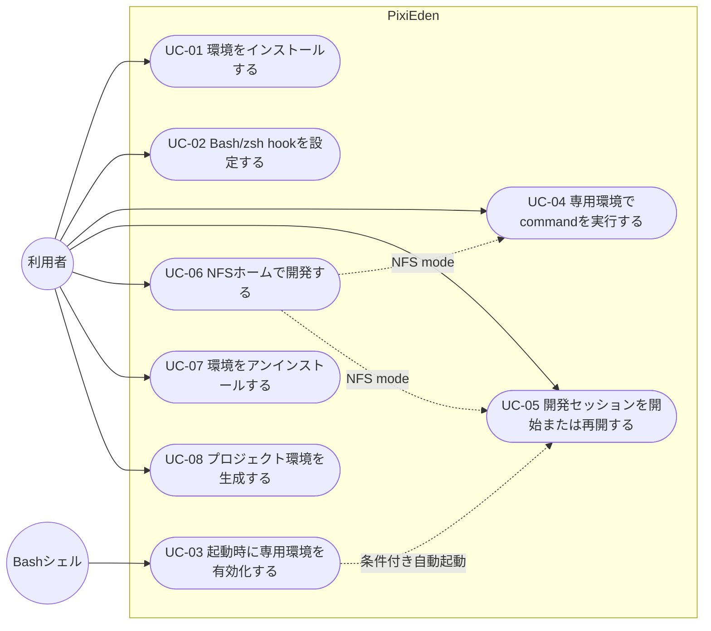

# ユースケース（UC）

この文書は、PixiEdenのシステム境界、アクター、主要ゴール、通常利用時のフローを定義する。背景と成功定義は[PRD](prd.ja.md)、価値と検証条件は[US/AC](user-stories.ja.md)、設計判断は[ADR](adr.ja.md)を参照する。

## システム境界

Mermaidの標準`flowchart`で、利用者とBashシェルを外部アクター、PixiEdenをシステム境界として表現する。NFSホームや永続セッションは、選択した設定に応じた通常フローである。個別のエラー復旧や管理者向け操作は、この図の対象外とする。

## 主要ユースケース

| ID | ゴール | 主アクター | 代表的な操作 | 関連US |
| --- | --- | --- | --- | --- |
| UC-01 | PixiEden環境を準備する | 利用者 | `pixied install` | [US-101](user-stories.ja.md#us-101) |
| UC-02 | Bash/zsh起動時のhookを設定する | 利用者 | `pixied hook bash`または`pixied hook zsh`の出力をshell設定へ追加する | [US-102](user-stories.ja.md#us-102) |
| UC-03 | 起動時に専用環境を有効化する | Bash/zshシェル | shell起動時にhookを評価する | [US-103](user-stories.ja.md#us-103) |
| UC-04 | 専用環境でcommandを実行する | 利用者 | `pixied run <command>` | [US-104](user-stories.ja.md#us-104) |
| UC-05 | 開発セッションを開始または再開する | 利用者 | `pixied shell` | [US-105](user-stories.ja.md#us-105) |
| UC-06 | NFSホームで開発する | 利用者 | `pixied install --home-mode nfs` | [US-106](user-stories.ja.md#us-106) |
| UC-07 | PixiEden環境を整理する | 利用者 | `pixied uninstall` | [US-107](user-stories.ja.md#us-107) |
| UC-08 | プロジェクトPixi環境を生成する | 利用者 | `pixied generate <devcontainer\|dockerfile\|direnv>` | [US-108](user-stories.ja.md#us-108) |

## 通常フロー

### UC-01

環境をインストールする。

1. 利用者がhome mode、local home、session managerなどを指定してinstallを実行する。
2. PixiEdenが専用Pixi環境、runtime hook、launcher、stateを準備する。
3. 利用者がBashまたはzsh hookを設定すると、以後のshell起動からUC-03を利用できる。

### UC-02

Bash/zsh起動時のhookを設定する。

1. 利用者が`pixied hook bash`または`pixied hook zsh`を実行する。
2. PixiEdenが生成済みruntime hookをsourceするshell codeを出力する。
3. 利用者が出力をshell設定へ明示的に追加する。

### UC-03

起動時に専用環境を有効化する。

1. Bashシェルが設定されたhookを評価する。
2. PixiEdenがstateとruntime artifactを検証する。
3. 専用の`HOME`、`PIXI_HOME`、`PATH`をshellへ設定する。
4. 条件を満たす対話TTYではUC-05を自動起動する。

### UC-04

専用環境でcommandを実行する。

1. 利用者が`pixied run <command>`を実行する。
2. PixiEdenが専用runtimeでcommandをforeground実行する。
3. commandの終了statusを利用者へ返す。

### UC-05

開発セッションを開始または再開する。

1. 利用者が対話TTY上で`pixied shell`を実行する。
2. `none`では専用の対話Bashを起動し、`zellij`では既存セッションへ接続する。
3. 既存セッションがなければ初回セッションを作成する。

### UC-06

NFSホームで開発する。

1. 利用者がNFS modeとmachine-localなlocal homeを選択する。
2. PixiEdenがPixi dataをlocal home側へ配置する。
3. UC-04またはUC-05の開始前にallowlistをpullし、正常終了後にpushする。

### UC-07

環境をアンインストールする。

1. 利用者が`pixied uninstall`を実行する。
2. PixiEdenがstate、path、owner、hashを検証する。
3. 現在のmachineが所有する資源を整理し、他machineが参照する共有資源は保持する。

### UC-08

プロジェクトPixi環境の連携ファイルを生成する。

1. 利用者がPixiプロジェクトのrootで生成形式を指定する。
2. PixiEdenがプロジェクト定義を検証し、既存ファイルの状態を確認する。
3. `direnv`、DevContainer、Dockerのいずれかに対応する生成物を、確認済みのpathへatomicに書き込む。
4. 生成物はPixiEdenの専用Pixi runtimeを土台にし、プロジェクト外やホストの既存Pixi環境へ影響を与えない。生成`.envrc`は`pixied generate direnv --print-envrc`形式で評価し、`pixied`がPATHにない生成時はCLIの絶対pathを使う。`--print-envrc`はファイルを書き込まない。生成`.envrc`の評価だけではNFS同期やsession起動を行わない。
