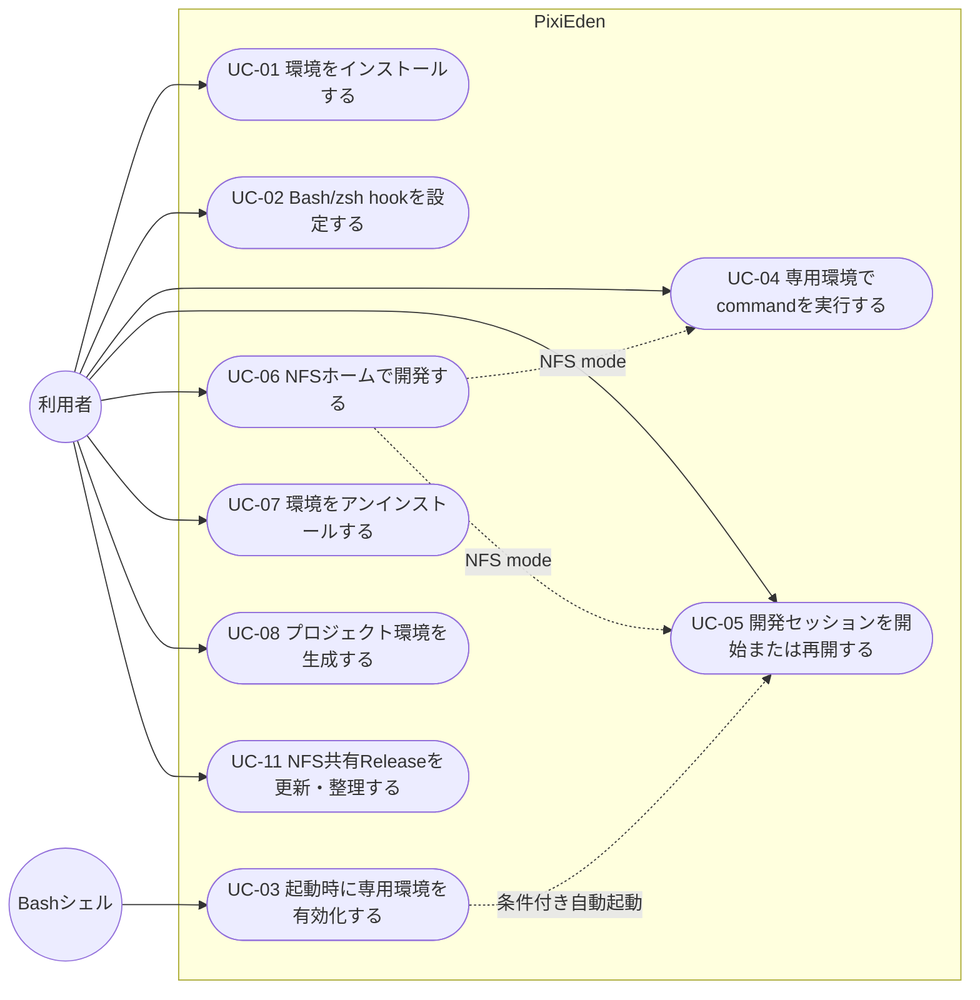

# ユースケース（UC）

この文書は、PixiEdenのシステム境界、アクター、主要ゴール、通常利用時のフローを定義する。背景と成功定義は[PRD](prd.ja.md)、価値と検証条件は[US/AC](user-stories.ja.md)、設計判断は[ADR](adr.ja.md)を参照する。

## システム境界

Mermaidの標準`flowchart`で、利用者とBashシェルを外部アクター、PixiEdenをシステム境界として表現する。NFSホームや永続セッションは、選択した設定に応じた通常フローである。個別のエラー復旧や管理者向け操作は、この図の対象外とする。

```mermaid
flowchart LR
    user((利用者))
    bash((Bashシェル))

    subgraph pixied[PixiEden]
        uc01([UC-01 環境をインストールする])
        uc02([UC-02 Bash/zsh hookを設定する])
        uc03([UC-03 起動時に専用環境を有効化する])
        uc04([UC-04 専用環境でcommandを実行する])
        uc05([UC-05 開発セッションを開始または再開する])
        uc06([UC-06 NFSホームで開発する])
        uc07([UC-07 環境をアンインストールする])
        uc08([UC-08 プロジェクト環境を生成する])
        uc11([UC-11 NFS共有Releaseを更新・整理する])
    end

    user --> uc01
    user --> uc02
    user --> uc04
    user --> uc05
    user --> uc06
    user --> uc07
    user --> uc08
    user --> uc11
    bash --> uc03

    uc03 -.->|条件付き自動起動| uc05
    uc06 -.->|NFS mode| uc04
    uc06 -.->|NFS mode| uc05
```

## 主要ユースケース

| ID | ゴール | 主アクター | 代表的な操作 | 関連US |
| --- | --- | --- | --- | --- |
| UC-01 | PixiEden環境を準備する | 利用者 | `pixied install` | [US-101](user-stories.ja.md#us-101) |
| UC-02 | Bash/zsh起動時のhookを設定する | 利用者 | `pixied hook bash`または`pixied hook zsh`の出力をshell設定へ追加する | [US-102](user-stories.ja.md#us-102) |
| UC-03 | 起動時に専用環境を有効化する | Bash/zshシェル | shell起動時にhookを評価する | [US-103](user-stories.ja.md#us-103) |
| UC-04 | 専用環境でcommandを実行する | 利用者 | `pixied run <command>` | [US-104](user-stories.ja.md#us-104) |
| UC-05 | 対話shellを開始する | 利用者 | `pixied shell` | [US-105](user-stories.ja.md#us-105) |
| UC-06 | NFSホームで開発する | 利用者 | `pixied install --home-mode nfs` | [US-106](user-stories.ja.md#us-106) |
| UC-07 | PixiEden環境を整理する | 利用者 | `pixied uninstall` | [US-107](user-stories.ja.md#us-107) |
| UC-08 | プロジェクトPixi環境を生成する | 利用者 | `pixied generate <devcontainer\|dockerfile\|direnv>` | [US-108](user-stories.ja.md#us-108) |
| UC-11 | NFS共有Releaseを更新・整理する | 利用者 | `pixied install`、`pixied version`、`pixied prune` | [US-110](user-stories.ja.md#us-110) |

## 通常フロー

### UC-01

環境をインストールする。

1. 利用者がhome modeとlocal homeを指定してinstallを実行する。
2. PixiEdenが専用Pixi環境、runtime hook、launcher、stateを準備する。
3. 利用者がBashまたはzsh hookを設定すると、以後のshell起動からUC-03を利用できる。

### UC-02

Bash/zsh起動時のhookを設定する。

1. 利用者が`pixied hook bash`または`pixied hook zsh`を実行する。
2. PixiEdenが生成済みruntime hookをsourceするshell codeを出力する。
3. 利用者が出力をshell設定へ明示的に追加する。

### UC-03

起動時に専用環境を有効化する。

1. Bashシェルが設定されたhookを評価する。
2. PixiEdenがstateとruntime artifactを検証する。
3. 専用の`HOME`、`PIXI_HOME`、`PATH`をshellへ設定する。
4. 対話shellでは専用direnv hookを評価する。

### UC-04

専用環境でcommandを実行する。

1. 利用者が`pixied run <command>`を実行する。
2. PixiEdenが専用runtimeでcommandをforeground実行する。
3. commandの終了statusを利用者へ返す。

### UC-05

対話shellを開始する。

1. 利用者が対話TTY上で`pixied shell`を実行する。
2. PixiEdenが専用runtimeを準備し、その中で対話Bashを起動する。

### UC-06

NFSホームで開発する。

1. 利用者がNFS modeとmachine-localなlocal homeを選択する。
2. PixiEdenがdata、config、専用`PIXI_HOME`、短時間lockとleaseをlocal home側へ配置し、state registryとshared dispatcherをaccount home側へ配置する。
3. shared dispatcherがcurrent machineのstateからlocal payloadへdispatchする。
4. UC-04またはUC-05の開始時にallowlistを`account→local`の一方向`reconcile`だけを行う。

### UC-07

環境をアンインストールする。

1. 利用者が`pixied uninstall`を実行する。
2. PixiEdenがstate、path、owner、hashを検証する。
3. 現在のmachineが所有するlocal資源を整理し、他machineが参照するshared dispatcherとRelease storeは保持する。
4. 最後のvalidなmachine stateを整理するときだけ、shared distributionの所有情報を検証して整理する。

### UC-08

プロジェクトPixi環境の連携ファイルを生成する。

1. 利用者がPixiプロジェクトのrootで生成形式を指定する。
2. PixiEdenがプロジェクト定義を検証し、既存ファイルの状態を確認する。
3. `direnv`は既存`.envrc`へ重複なくブロックを挿入する。`devcontainer`/`dockerfile`は既定で既存ファイルを上書きせずエラーで終了し、`--force`指定時に上書きして直前のファイルを`<name>.bak`へ1世代backupする。
4. 生成物はPixiEdenの専用Pixi runtimeを土台にし、プロジェクト外やホストの既存Pixi環境へ影響を与えない。生成`.envrc`は`pixied generate direnv --print-envrc`形式で評価し、`pixied`がPATHにない生成時はCLIの絶対pathを使う。`--print-envrc`はファイルを書き込まない。生成`.envrc`の評価だけではNFS同期やsession起動を行わない。

### UC-09

アクティブruntime内から再インストールする。

1. 利用者が専用環境を有効化したruntime shellから`pixied install`を実行する。
2. PixiEdenが`PIXIED_RUNTIME_HOOK_ACTIVE=1`と`PIXIED_RUNTIME_STATE_FILE`の両方を検証し、アクティブruntimeと判定する。
3. PixiEdenが検証済みstate fileをidentityのsource of truthとして読み込み、指定されたidentity変更option（`--home-mode`、`--local-home`、`--machine-id`、`--pixi-home`）を却下する。
4. それ以外のオプションで設定を更新し、stateを書き込む。現在のruntime shellが保持する環境は変えず、`exit`後に新しいshellを開始したruntimeにのみ反映する。

### UC-10

アクティブruntime内からアンインストールする。

1. 利用者が専用環境を有効化したruntime shellから`pixied uninstall`を実行する。
2. PixiEdenがアクティブruntimeかつ検証済みstate fileをsource of truthとしてidentityを解決する（`$HOME`からは再計算しない）。
3. PixiEdenが所有資源を整理してstateを更新する。現在のruntime shellが保持する環境は変えず、`exit`後に新しいshellを開始したruntimeにのみ反映する。

### UC-11

NFS共有Releaseを更新・整理する。

1. 利用者が一台で公開installerを実行し、checksumを検証したReleaseをshared state rootへpublishする。
2. PixiEdenがimmutableなversioned Releaseを保存し、`current`をatomicに選択して、実行hostのlocal payloadを更新する。
3. 別hostの利用者が`pixied version`を実行すると、shared Releaseとlocal payloadのversionを確認できる。
4. 別hostの利用者が`pixied install`を実行すると、network downloadなしでshared`current`からlocal payloadを更新できる。version不一致中のruntime commandは自動更新せず、local payloadを続行する。
5. 利用者が`pixied prune --keep N`を実行すると、`current`、保持数、liveなrelease leaseを保護したうえで、検証済みReleaseだけを整理する。
